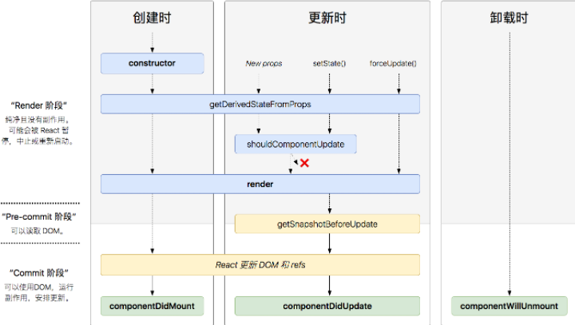

当然，这些都是非常经典的前端面试问题。我为你整理了一份清晰、准确的回答，你可以用它来准备面试。

---

### **二、框架与状态管理**

**2. 状态管理 Pinia，路由 vue-router**

* **Pinia**： 是 Vue.js 的官方推荐的状态管理库。它相比之前的 Vuex 更简单，具有完整的 TypeScript 支持，并且提供了 `state`、`getters`、`actions` 来集中管理组件的共享状态，解决了多层组件嵌套传值的繁琐问题。
* **vue-router**： 是 Vue.js 的官方路由管理器。它用于构建单页面应用，通过管理 URL 路径与组件的映射关系，实现页面间的无刷新跳转、动态路由、导航守卫等功能。

### **三、Vue 相关**

**3. v-if 和 v-show 的区别**

* **`v-if`**：是“真正的”条件渲染，它会确保在切换过程中条件块内的事件监听器和子组件适当地被销毁和重建。如果初始条件为假，则什么也不做，直到条件变为真时才开始渲染。**它会引起 DOM 元素的添加和移除**。
* **`v-show`**：不管初始条件是什么，元素总是会被渲染，只是简单地基于 CSS 的 `display` 属性进行切换。**它始终保留在 DOM 中，仅改变 `display: none/block`**。
* **使用场景**：`v-if` 有更高的切换开销，而 `v-show` 有更高的初始渲染开销。因此，如果需要非常频繁地切换，则使用 `v-show` 较好；如果在运行时条件很少改变，则使用 `v-if` 较好。

### **四、CSS 与渲染优化**

**4. 元素在视窗范围内不可见的方法**

1. `display: none`：元素不显示，并且不占据文档流空间。
2. `visibility: hidden`：元素不可见，但依然占据空间。
3. `opacity: 0`：元素完全透明，不可见，但依然可以触发事件（如点击）。
4. 通过 `position` 定位将其移出可视区域（如 `left: -9999px`）。
5. 使用 `clip-path: inset(100%)` 将其裁剪掉。

**5. visibility 和 opacity 两者有何区别**

* **`visibility: hidden`**：
  * 元素不可见，**但仍在文档流中占据空间**。
  * **不会响应绑定的事件**（如点击）。
  * 会引起重绘。
* **`opacity: 0`**：
  * 元素完全透明，不可见，**但仍在文档流中占据空间**。
  * **会响应绑定的事件**（如点击）。
  * 会创建一个新的图层，通常由 GPU 加速，性能较好。

**6. display: none 会引起页面重绘还是重排？**
**重排**。因为 `display: none` 会使元素从渲染树中完全消失，导致其自身及其所有子元素都不再占据空间，从而改变了页面的布局（几何属性），所以浏览器需要重新计算布局（重排），然后重新绘制。

**7. 你在开发一个页面时，有哪些方法可以减少重排和重绘？**

1. **集中改变样式**：使用 `classList` 或 `cssText` 一次性修改样式，而非频繁操作 `style`。
2. **使用 `transform` 和 `opacity` 来实现动画**：它们的变化由合成器处理，不会触发重排或重绘。
3. **避免使用表格布局**：表格的微小变化都会导致整个表格的重排。
4. **批量 DOM 操作**：使用文档片段 `DocumentFragment` 进行离线 DOM 操作，然后一次性添加到文档中。
5. **读写分离**：避免先读一个布局属性（如 offsetWidth），然后立即写一个属性，这会强制浏览器提前进行重排以提供最新值。应将读操作集中在一起。

### **五、路由与构建工具**

**8. 前端路由有哪几种方式**

* **Hash 模式**：利用 URL 中的 hash (`#`) 变化来实现路由。hash 变化不会导致浏览器向服务器发送请求。通过监听 `window.onhashchange` 事件。
* **History 模式**：利用 HTML5 History API (`pushState`, `replaceState`) 来修改 URL，而不刷新页面。需要服务器端配置支持，以避免直接访问子路径时返回 404。

**9. 导航守卫如何实现？**
在 vue-router 中，导航守卫主要通过路由实例上的钩子函数实现，用来在路由跳转前、跳转后或跳转过程中进行控制。

* **全局前置守卫**：`router.beforeEach((to, from, next) => { ... })`，常用于权限验证。
* **全局解析守卫**：`router.beforeResolve`
* **全局后置钩子**：`router.afterEach((to, from) => { ... })`，没有 `next` 参数，常用于分析、修改页面标题等。
* **路由独享的守卫**：在路由配置中直接定义 `beforeEnter`。
* **组件内的守卫**：在组件中定义 `beforeRouteEnter`、`beforeRouteUpdate`、`beforeRouteLeave`。

**10. Webpack 和 Vite 的区别，为什么 Vite 快？**

* **Webpack**：基于**打包器**的理念。在开发服务器启动前，需要先打包构建整个项目，生成 bundle 文件后才会启动服务器。项目越大，启动和热更新越慢。
* **Vite**：基于**ESM** 和 **原生 ES 模块**。在开发环境下，它不打包代码，而是直接启动一个服务器。浏览器按需请求模块，Vite 服务器按需编译并提供它们。**快的原因**：
  1. **无需打包**：消除了打包器的编译成本。
  2. **按需编译**：只编译当前屏幕上实际需要的代码。
  3. **利用浏览器缓存**：依赖模块（如 npm 包）使用强缓存，源码模块使用协商缓存。

**11. Vite 通过什么编译？**

* 在生产环境下，Vite 使用 **Rollup** 进行打包，因为它更高效和简洁。
* 在开发环境下，Vite 本身充当了一个**按需编译的服务器**，它使用 **esbuild** 进行依赖预构建和 TS/JSX 的转换，因为 esbuild 用 Go 编写，编译速度极快。

**12. Webpack 有使用过吗？**
（根据你的实际情况回答）是的，在之前的项目/学习中用过。了解其核心概念：**入口、输出、Loader、插件**。Loader 用于转换特定类型的模块（如将 Sass 转为 CSS），插件用于执行更广泛的任务（如打包优化、资源管理等）。

### **六、性能优化与网络**

**13. 实现图片懒加载方式？如何判断滚动到这个图片资源？**

* **方法**：将图片的 `src` 属性暂存到 `data-src` 等自定义属性中。当图片进入可视区域时，再将 `data-src` 的值赋给 `src`。
* **判断方式**：
  1. **传统方式**：监听 `scroll` 事件，使用 `Element.getBoundingClientRect()` 获取图片位置，与视口高度比较。需要节流优化。
  2. **现代方式**：使用 **`IntersectionObserver` API**（见下题）。

**14. 有了解过 IntersectionObserver 这个 API 吗？**
是的。它是一个现代的浏览器 API，可以**异步**监听目标元素与其祖先元素或视口交叉状态的变化。用它实现懒加载非常简单高效：

```javascript
const observer = new IntersectionObserver((entries) => {
  entries.forEach(entry => {
    if (entry.isIntersecting) { // 如果进入视口
      const img = entry.target;
      img.src = img.dataset.src; // 开始加载图片
      observer.unobserve(img); // 停止观察
    }
  });
});
// 对所有需要懒加载的图片调用 observer.observe(imgElement);
```

**15. HTTP 状态码 301、302**

* **301 Moved Permanently**：**永久重定向**。请求的资源已被永久移动到新位置。浏览器会缓存这个重定向，下次会直接访问新地址。
* **302 Found**：**临时重定向**。请求的资源临时从不同的位置响应。浏览器不会缓存，下次请求可能还会发往原地址。

### **七、数据请求与媒体处理**

**16. 前后端交互中，数据请求部分如何实现？用什么来发送请求？**
通常使用 JavaScript 提供的 `fetch` API 或第三方库（如 **`axios`**）来发送 HTTP 请求。我个人更常用 `axios`，因为它功能更强大，例如：提供了请求和响应拦截器、自动转换 JSON 数据、客户端支持防御 XSRF 等。

**17-19. 视频相关问题**
（这些问题非常专业，如果你不熟悉，可以坦诚说明。以下为简要答案）

* **17. 逐帧转换**：可以通过 HTML5 的 `<video>` 元素和 `<canvas>` 元素结合实现。将视频绘制到 Canvas 上，然后使用 `canvas.getContext('2d').getImageData()` 获取像素数据进行分析或处理。
* **18. FFmpeg**：是一个强大的开源音视频处理工具库，可以进行格式转换、剪辑、截图、添加水印等操作。通常在**后端**或**Node.js环境**下使用。
* **19. 视频帧与上传**：
  * **帧类型**：I帧（关键帧，完整图像）、P帧（向前预测帧，依赖前一帧）、B帧（双向预测帧，依赖前后帧）。
  * **上传过程**：前端将视频文件通过 HTTP `POST` 请求以 `multipart/form-data` 格式发送给后端接口。对于大文件，通常会进行**分片上传**和**断点续传**。

### **八、JavaScript & 浏览器存储**

**20. Promise 中有哪些方法？**

* **实例方法**：
  * `.then()`：处理成功状态。
  * `.catch()`：处理失败状态。
  * `.finally()`：无论成功失败都会执行。
* **静态方法**：
  * `Promise.all()`：全部成功才算成功，一个失败立即失败。
  * `Promise.race()`：竞速，第一个改变状态的 Promise 决定结果。
  * `Promise.allSettled()`：等待所有 Promise 完成（无论成功失败），返回结果数组。
  * `Promise.any()`：只要有一个成功就算成功，全部失败才失败。
  * `Promise.resolve()/reject()`：创建一個已成功/已失败的 Promise。

**21. localStorage**
是浏览器提供的一种本地存储机制，用于将数据**持久化**地存储在浏览器中，除非主动清除，否则数据不会过期。存储大小通常为 5MB，仅在客户端使用，不随 HTTP 请求发送到服务器。

### **九、CSS 布局与单位**

**22. 如何实现子元素水平垂直居中？**

* **Flexbox**：
  ```css
  .parent { display: flex; justify-content: center; align-items: center; }
  ```
* **Grid**：
  ```css
  .parent { display: grid; place-items: center; }
  ```
* **绝对定位 + transform**：
  ```css
  .child { position: absolute; top: 50%; left: 50%; transform: translate(-50%, -50%); }
  ```

**23. Grid 布局中 1fr 表示什么？**
`fr` 是**分数单位**。`1fr` 表示在容器剩余空间中所占的一份。例如 `grid-template-columns: 1fr 2fr;` 表示两列，第二列的宽度是第一列的两倍。

**24. rem, em 有什么区别？宽度设置 50vw 表示什么？**

* **rem**：相对于**根元素**的字体大小。
* **em**：相对于**父元素**的字体大小。
* **50vw**：表示视口宽度的 50%。

### **十、综合与学习**

**25. 页面加载优化方式有哪些？**

1. **资源优化**：压缩代码和图片，使用 Tree Shaking，代码分割，懒加载。
2. **网络优化**：利用浏览器缓存，使用 CDN，开启 Gzip 压缩。
3. **渲染优化**：CSS 放头部，JS 放底部或使用 `async/defer`，减少重排重绘。
4. **关键技术**：服务端渲染，预加载关键资源。

**26. 服务端渲染相比普通渲染的优势？**

* **更好的首屏加载性能**：服务器直接返回渲染好的 HTML，用户无需等待 JS 下载和执行就能看到内容。
* **更好的 SEO**：搜索引擎爬虫可以直接抓取已渲染的页面内容。

**27. 一周内学习新技术栈的规划？**

1. **目标定位**：明确学习目标和核心应用场景。
2. **官方文档**：花 1-2 天快速通读官方文档和指南，并动手写 Demo。
3. **项目实践**：用 3-4 天基于该技术做一个核心功能完整的小项目。
4. **查漏补缺**：最后 1-2 天回顾总结，查阅社区文章，解决项目中遇到的问题。
5. **总结输出**：通过写博客或笔记来巩固知识。

**28. 小程序了解过吗？**
（根据实际情况回答）是的，了解过。知道其开发类似于前端，但使用特定的标签和 API，逻辑层和渲染层分离，以及有一套自己的生命周期和发布流程。

**29. AI 开发工具，如何帮助学习？**
AI 工具可以作为强大的学习助手：

1. **个性化答疑**：随时解答疑惑，提供代码示例。
2. **代码审查与优化**：分析代码，提出改进建议。
3. **生成学习路径**：根据目标生成定制化的学习大纲。
4. **模拟面试**：进行技术面试练习。



---

---

好的，这是后续问题的详细解答，同样以清晰、准确为目标，方便你面试时使用。

---

### **三、网络协议**

**3. 项目中有使用 WebSocket，说说 HTTP 和 WebSocket 的不同**

| 特性               | HTTP                                                                | WebSocket                                                                      |
| :----------------- | :------------------------------------------------------------------ | :----------------------------------------------------------------------------- |
| **通信模式** | **请求-响应**模式。客户端发起请求，服务器返回响应后连接关闭。 | **全双工通信**模式。建立连接后，双方可以随时主动向对方发送数据。         |
| **连接状态** | **无状态**。每个请求都是独立的，服务器不记录状态。            | **有状态**。建立一次连接后，连接会保持，直到一方主动关闭。               |
| **协议开销** | 每次请求都包含完整的**请求头/响应头**，开销较大。             | 建立连接时通过 HTTP 握手，之后数据传输**头部开销极小**。                 |
| **适用场景** | 获取网页、提交表单等**短连接、一次性**的数据交互。            | 实时聊天、实时游戏、股票行情、协同编辑等需要**长连接、高实时性**的场景。 |

**核心区别**：HTTP 像**发邮件**，一来一回；WebSocket 像**打电话**，接通后可以持续对话。

**4. 详细说说 TCP 三次握手和四次挥手**

**三次握手 - 建立连接（保证双方都有发送和接收的能力）**

1. **第一次**：客户端发送 `SYN=1` 和随机序列号 `seq=x` 给服务器。客户端进入 `SYN_SENT` 状态。
2. **第二次**：服务器收到后，回复 `SYN=1`, `ACK=1`，确认号 `ack=x+1`，以及自己的随机序列号 `seq=y`。服务器进入 `SYN_RCVD` 状态。
3. **第三次**：客户端收到后，再发送 `ACK=1`，确认号 `ack=y+1`, `seq=x+1`。服务器收到后，双方进入 `ESTABLISHED` 状态，连接建立。

**四次挥手 - 终止连接（双方都要确认数据已发送完毕）**

1. **第一次**：客户端（主动关闭方）发送 `FIN=1` 和序列号 `seq=u`。客户端进入 `FIN_WAIT_1` 状态。
2. **第二次**：服务器收到 `FIN` 后，发送 `ACK=1`, 确认号 `ack=u+1`, 序列号 `seq=v`。服务器进入 `CLOSE_WAIT` 状态。客户端收到后进入 `FIN_WAIT_2` 状态。
   *（此时，从客户端到服务器的连接关闭，但服务器可能还有数据要发送给客户端）*
3. **第三次**：服务器发送完所有数据后，发送 `FIN=1`, `ACK=1`, 确认号 `ack=u+1`, 序列号 `seq=w`。服务器进入 `LAST_ACK` 状态。
4. **第四次**：客户端收到后，发送 `ACK=1`, 确认号 `ack=w+1`, 序列号 `seq=u+1`。客户端进入 `TIME_WAIT` 状态，等待 `2MSL` 后关闭。服务器收到 `ACK` 后立即关闭。

---

### **五、CSS 深入**

**5. 谈谈 CSS 的盒模型**
CSS 盒模型规定了一个元素所占用的总空间，由内容、内边距、边框和外边距组成。

* **标准盒模型**：
  * `width` 和 `height` 属性只指**内容区域**的宽高。
  * 元素总宽度 = `width` + `padding` + `border` + `margin`
* **IE盒模型**：
  * `width` 和 `height` 属性包含了**内容、内边距和边框**。
  * 元素总宽度 = `width` + `margin`
* **控制**：可以通过 `box-sizing` 属性切换。`content-box`（标准） / `border-box`（IE）。

**6. CSS 有哪些水平垂直居中的方式**

* **Flexbox**：`display: flex; justify-content: center; align-items: center;`
* **Grid**：`display: grid; place-items: center;`
* **绝对定位 + Transform**：`position: absolute; top: 50%; left: 50%; transform: translate(-50%, -50%);`
* **绝对定位 + Margin**：`position: absolute; top: 0; right: 0; bottom: 0; left: 0; margin: auto;`（需定宽高）

**7. 你谈到了 flex 布局，flex 布局如何实现换行**
使用 `flex-wrap` 属性。

* `flex-wrap: nowrap;`（默认，不换行）
* `flex-wrap: wrap;`（换行，第一行在上方）
* `flex-wrap: wrap-reverse;`（换行，第一行在下方）

---

### **六、JavaScript 核心**

**8. JS 都有哪些数据类型？**

* **基本数据类型**：`Undefined`, `Null`, `Boolean`, `Number`, `String`, `BigInt`, `Symbol`
* **引用数据类型**：`Object`（包括 `Array`, `Function`, `Date` 等）

**9. 基本数据类型和引用数据类型有什么不同吗？**

* **存储位置**：基本数据类型的数据直接存储在**栈**中；引用数据类型的地址存储在**栈**中，实际数据存储在**堆**中。
* **复制行为**：复制基本数据类型，是**值的拷贝**，互不影响。复制引用数据类型，是**地址的拷贝**，两个变量指向同一个对象，会相互影响。
* **比较方式**：基本数据类型比较**值**是否相等。引用数据类型比较**内存地址**是否相同。

**10. 有没有听过深拷贝和浅拷贝**

* **浅拷贝**：只复制对象的第一层属性。如果属性是引用类型，则复制其地址。例如 `Object.assign()`, 展开运算符 `...`。
* **深拷贝**：完全复制一个对象，包括它里面所有层级的引用类型属性，创建一个完全独立的新对象。例如 `JSON.parse(JSON.stringify(obj))`（有局限性），或使用工具库 `lodash.cloneDeep`。

---

### **七、React 与算法**

**11. React 里面 Key 的作用是什么？**
`key` 是 React 用于**识别列表中哪些元素被改变、添加或删除**的唯一标识。当列表数据变化时，React 会使用 `key` 来进行高效的 **Diff 算法**对比，从而最小化 DOM 操作，提升性能。

**12. 虚拟 DOM 是什么？**
虚拟 DOM 是一个**轻量的 JavaScript 对象**，它是真实 DOM 的抽象表示。当状态变化时，React 会先计算出新的虚拟 DOM，然后通过 **Diff 算法** 与旧的虚拟 DOM 进行比较，找出最小差异，最后**批量、高效地**将这些差异更新到真实 DOM 上。这避免了直接操作真实 DOM 带来的性能损耗。

**13. 现写一个将一维数组变成二维数组的函数**

```javascript
function chunkArray(arr, chunkSize) {
  const result = [];
  for (let i = 0; i < arr.length; i += chunkSize) {
    // 从原数组中截取 chunkSize 长度的片段，并推入结果数组
    result.push(arr.slice(i, i + chunkSize));
  }
  return result;
}

// 测试
const input = [1, 2, 3, 4, 5];
console.log(chunkArray(input, 2)); // 输出：[[1,2], [3,4], [5]]
```

**核心思路**：使用 `for` 循环，以 `chunkSize` 为步长遍历原数组，在每次循环中使用 `Array.prototype.slice` 方法截取相应长度的子数组并放入新数组。

---

---

好的，这是一份非常全面的前端面试题集（不涉及代码编写）。我将为您逐一解答这些问题。

---

### **一、浏览器与渲染机制**

**1. 浏览器的渲染过程是怎样的？**
浏览器渲染页面的过程主要分为以下几个步骤：

1. **解析 HTML**：构建 DOM（文档对象模型）树。
2. **解析 CSS**：构建 CSSOM（CSS对象模型）树。
3. **合并成渲染树**：将 DOM 树和 CSSOM 树合并，形成渲染树，这只包含可见的节点。
4. **布局**：计算渲染树中每个节点的确切位置和大小（几何信息），这个过程也称为“重排”。
5. **绘制**：将布局后的节点像素绘制到屏幕上，也称为“光栅化”。
6. **合成**：将各层绘制结果合成到一起，显示在屏幕上。

**2. 什么是回流与重绘？触发条件有哪些？**

* **回流**：当渲染树中的一部分或全部因为元素的规模、布局、隐藏等改变而需要重新构建，这个过程称为回流。**回流必然引发重绘**。
* **重绘**：当渲染树中的一些元素需要更新属性，而这些属性只是影响元素的外观、风格，而不会影响布局的（例如 `color`, `background-color` 等），这个过程称为重绘。

**常见触发条件：**

* **回流**：添加/删除可见DOM元素、元素位置/尺寸改变（`width`, `height`, `margin`, `padding`, `position`等）、页面首次渲染、浏览器窗口大小改变、计算 `offsetWidth`, `scrollTop` 等布局信息。
* **重绘**：改变 `color`, `background`, `visibility`, `outline` 等样式。

**3. CSS 选择器优先级如何计算？**
优先级由A、B、C、D四个值（或称为四级）来决定，计算规则如下：

1. **内联样式**：`A=1`。
2. **ID 选择器**：`B=` ID选择器的个数。
3. **类选择器、属性选择器、伪类**：`C=` 这些选择器的个数。
4. **元素选择器、伪元素**：`D=` 这些选择器的个数。

**比较方式**：从A到D依次比较，数值大的优先级高。`!important` 的优先级最高，但它不参与等级计算。

**4. 什么是 BFC？有哪些触发方式？**
BFC 是一个独立的渲染区域，内部元素的布局不会影响到外部。
**触发条件**：

* `float` 的值不是 `none`。
* `position` 的值是 `absolute` 或 `fixed`。
* `display` 的值是 `inline-block`, `table-cell`, `flex`, `inline-flex` 等。
* `overflow` 的值不是 `visible`。

**作用**：清除浮动、防止外边距重叠、阻止元素被浮动元素覆盖。

**5. DOCTYPE 的作用是什么？**
`<!DOCTYPE>` 声明位于文档最前面，告诉浏览器以何种文档类型规范来解析这个文档。**它的主要目的是开启浏览器的标准模式**，使浏览器按照 W3C 标准来渲染页面，避免浏览器的怪异模式。

**6. 盒模型有哪两种？主要区别是什么？**

* **标准盒模型**：`width` 和 `height` 只包含内容区域。
* **IE盒模型**：`width` 和 `height` 包含内容、内边距和边框。

**区别**：`box-sizing` 属性可以控制。

* `content-box`：标准盒模型。
* `border-box`：IE盒模型。

---

### **二、JavaScript 核心**

**7. 简述 JavaScript 原型与原型链机制。**

* **原型**：每个函数都有一个 `prototype` 属性，它指向一个对象，这个对象就是该函数的原型对象。
* **原型链**：每个对象都有一个 `__proto__` 属性，指向创建它的构造函数的原型对象。当访问一个对象的属性时，如果该对象自身没有，就会通过 `__proto__` 去它的原型上找，如果原型上也没有，就去原型的原型上找，直到找到 `Object.prototype` 为止，这种链式结构就是原型链。

**8. JS 事件传播的三个阶段是什么？**

1. **捕获阶段**：事件从 `window` 对象自上而下向目标元素传播。
2. **目标阶段**：事件到达目标元素。
3. **冒泡阶段**：事件从目标元素自下而上向 `window` 对象传播。

**9. 防抖与节流的区别？分别适用于哪些场景？**

* **防抖**：在事件被触发 n 秒后再执行回调，如果在这 n 秒内又被触发，则重新计时。
  * **场景**：搜索框输入、窗口 resize。
* **节流**：规定在一个单位时间内，只能触发一次函数。如果这个单位时间内触发多次函数，只有一次生效。
  * **场景**：滚动加载、鼠标不断点击、搜索联想。

**10. Promise 是什么？如何实现链式调用？**

* **是什么**：Promise 是异步编程的一种解决方案，代表一个未来才会知道结果的事件。它有三种状态：`pending`, `fulfilled`, `rejected`。
* **链式调用**：Promise 的 `then` 和 `catch` 方法本身会返回一个新的 Promise，这个新 Promise 的状态由前一个回调函数的返回值决定，因此可以不断地调用 `.then`。

**11. async/await 的本质是什么？底层基于什么实现？**

* **本质**：`async/await` 是 Generator 函数的语法糖，它使得异步代码的写法更像同步代码。
* **底层实现**：基于 Promise 和 Generator 实现。`async` 函数返回一个 Promise 对象。`await` 命令后面可以是一个 Promise 对象或原始类型的值（会自动转为 resolved 的 Promise）。执行到 `await` 时，会暂停当前 `async` 函数的执行，等待后面的 Promise 完成，然后恢复执行并返回结果。

---

### **三、网络与HTTP**

**12. 常见的 HTTP 状态码有哪些？含义分别是什么？**

* `2xx` 成功：
  * `200 OK`：请求成功。
* `3xx` 重定向：
  * `301 Moved Permanently`：永久重定向。
  * `302 Found`：临时重定向。
* `4xx` 客户端错误：
  * `400 Bad Request`：请求语法错误。
  * `401 Unauthorized`：未授权。
  * `403 Forbidden`：服务器拒绝执行。
  * `404 Not Found`：资源未找到。
* `5xx` 服务器错误：
  * `500 Internal Server Error`：服务器内部错误。
  * `502 Bad Gateway`：网关错误。

**13. GET 和 POST 请求的核心区别？**

* **语义**：GET 用于获取数据，POST 用于提交数据。
* **参数位置**：GET 参数在 URL 中，POST 参数在请求体中。
* **安全性**：都不安全，但 GET 参数直接暴露在 URL 中，更不安全。
* **幂等性**：GET 是幂等的（多次请求效果相同），POST 不是。
* **可缓存**：GET 请求可被缓存，POST 一般不会。

**14. 浏览器缓存有哪些类型？如何通过响应头设置？**

* **强缓存**：直接从本地缓存读取资源，不向服务器发送请求。
  * `Expires`（HTTP/1.0）：过期时间。
  * `Cache-Control`（HTTP/1.1）：`max-age=3600`。
* **协商缓存**：向服务器发送请求，服务器判断资源是否过期。
  * `Last-Modified` / `If-Modified-Since`：基于修改时间。
  * `ETag` / `If-None-Match`：基于资源标识，优先级更高。

---

### **四、Vue 框架**

**15. Vue 双向绑定的原理是什么？**
Vue 2.x 采用 **数据劫持结合发布者-订阅者模式** 的方式，通过 `Object.defineProperty()` 来劫持各个属性的 setter 和 getter，在数据变动时发布消息给订阅者，触发相应的监听回调。Vue 3.x 使用 **Proxy** 来拦截对象的操作，实现更强大和全面的响应式。

**16. Vue 组件间通信有哪些方式？**

* 父子组件：`props` / `$emit`
* 父访问子：`$refs`
* 子访问父：`$parent`
* 兄弟组件：EventBus / Vuex / Pinia
* 跨级组件：`provide` / `inject`
* 状态管理库：Vuex / Pinia

**17. 虚拟 DOM 与真实 DOM 的关系和差异？**

* **关系**：虚拟 DOM 是真实 DOM 的一个轻量级 JavaScript 对象表示。
* **差异**：
  * **性能**：操作虚拟 DOM 比操作真实 DOM 快得多。
  * **流程**：数据变化时，Vue 会生成新的虚拟 DOM 树，与旧的虚拟 DOM 树进行 Diff 算法比较，找出最小差异，然后一次性批量更新到真实 DOM 上。

**18. Vue 路由的模式有哪些？hash 与 history 的区别？**

* **Hash 模式**：URL 中带 `#` 号。通过监听 `hashchange` 事件实现。兼容性好，部署简单。
* **History 模式**：URL 更美观，像普通 URL。通过 HTML5 History API 实现。需要服务器端支持，避免 404 错误。

---

### **五、工程化与性能**

**19. 前端性能优化可以从哪些方面入手？**

* **加载优化**：减少HTTP请求、代码压缩、Tree Shaking、懒加载、CDN。
* **渲染优化**：避免回流重绘、使用 `transform` 和 `opacity` 实现动画、防抖节流、虚拟列表。
* **缓存优化**：合理利用浏览器缓存、Service Worker。
* **网络优化**：使用 HTTP/2、预连接、资源预加载。

**20. 前端模块化规范有哪些？CommonJS 与 ES6 Module 的区别？**

* **规范**：CommonJS、AMD、CMD、ES6 Module。
* **区别**：
  * **语法**：CommonJS 是 `require/module.exports`；ES6 Module 是 `import/export`。
  * **加载时机**：CommonJS 是运行时加载（同步）；ES6 Module 是编译时静态加载（异步）。
  * **输出**：CommonJS 输出的是值的拷贝；ES6 Module 输出的是值的引用。

---

### **六、TypeScript**

**21. TypeScript 相比 JavaScript 有哪些优势？**

* **静态类型检查**：在编译阶段发现错误，提高代码质量和可维护性。
* **更好的 IDE 支持**：智能提示、代码补全、重构。
* **提供最新 ECMAScript 特性**。
* **增强面向对象能力**。

**22. interface 和 type 在 TypeScript 中有何异同？**

* **相同点**：都可以用来定义对象或函数的形状。
* **不同点**：
  * **扩展**：`interface` 使用 `extends`，`type` 使用 `&`。
  * **合并**：同名的 `interface` 会自动合并，而 `type` 会报错。
  * **范围**：`type` 可以声明基本类型、联合类型、元组等，而 `interface` 主要用于对象。

---

### **七、调试与监控**

**23. 如何检测前端内存泄漏？常用方法有哪些？**

* **表现**：页面卡顿、崩溃。
* **检测工具**：
  * **Chrome DevTools Performance & Memory 面板**：录制内存变化，查看内存占用趋势。
  * **Chrome Task Manager**：查看浏览器标签页的内存和CPU占用。
* **常见原因**：意外的全局变量、未清除的定时器/事件监听器、DOM 引用未释放。

**24. 前端调试常用工具和方法有哪些？**

* **浏览器 DevTools**：Console、Sources、Network、Elements 面板。
* **`console.log` / `debugger` 语句**。
* **Source Map**：将压缩后的代码映射回源代码，便于调试。
* **Vue/React DevTools**：浏览器插件，专门用于调试 Vue/React 应用。

---

希望这份详细的解答能帮助您更好地准备面试！

---

---

好的，这些是非常深入和高质量的前端及工程化问题。我将为您逐一详细解答。

---

### **一、计算机基础与数据结构**

**1. 了解过 CA 证书吗？**
CA 证书是由可信的证书颁发机构签发的数字证书，用于实现 HTTPS 加密通信。其核心原理基于非对称加密。

* **工作流程**：
  1. 服务器将自己的公钥和身份信息提交给 CA。
  2. CA 核实服务器身份后，用自己的私钥对服务器的公钥等信息进行签名，生成数字证书。
  3. 浏览器向服务器发起 HTTPS 请求时，服务器返回该证书。
  4. 浏览器内置了信任的 CA 的公钥。浏览器用这个公钥解密证书签名，验证其真实性，并确认证书中的网站地址与实际访问地址一致。
  5. 验证通过后，浏览器生成一个对称加密的密钥，并用证书里的服务器公钥加密后发送给服务器。后续通信使用该对称密钥进行加密。

**2. 说说 HTTP/1.1**

* **持久连接**：默认开启 `Connection: keep-alive`，一个 TCP 连接可以传输多个 HTTP 请求/响应，减少了建立/关闭连接的开销。
* **管道化**：允许在同一个连接上同时发送多个请求，但响应必须按请求的顺序返回，容易引起队头阻塞。
* **主机头**：`Host` 头是必须的，使得同一个 IP 可以托管多个域名，为虚拟主机提供了基础。
* **缓存增强**：引入了 `Cache-Control`、`ETag` 等更强大的缓存控制头。

**3. 说说链表**
链表是一种线性数据结构，其中的元素（节点）通过指针连接在一起。

* **节点结构**：每个节点包含两部分——存储数据的 `data` 和指向下一个节点地址的 `next` 指针。
* **类型**：单向链表、双向链表、循环链表。
* **特点**：内存非连续，增删效率高（O(1)），但查询效率低（O(n)），无法随机访问。

**4. 说说指针**
指针是一个变量，其值是另一个变量的内存地址。它提供了直接操作内存的能力。

* 在 C/C++ 中显式存在。
* 在 JavaScript 中，没有暴露给开发者的传统指针概念，但对象和函数的引用传递在底层可以理解为一种“安全的指针”。

**5. 数组和链表差别体现在哪？**

| 特性                | 数组                               | 链表                     |
| :------------------ | :--------------------------------- | :----------------------- |
| **内存布局**  | 连续内存块                         | 非连续，通过指针链接     |
| **大小**      | 固定（静态数组）或可变（动态数组） | 动态，按需分配           |
| **访问**      | **随机访问**，O(1)           | **顺序访问**，O(n) |
| **插入/删除** | 平均 O(n)，需要移动元素            | 平均 O(1)，只需修改指针  |
| **空间开销**  | 小，仅存储数据                     | 大，需要额外空间存储指针 |

---

### **二、JavaScript 深度**

**6. Object.defineProperty 有哪些属性，作用是什么？**
主要用于精确地添加或修改对象的属性。

* `value`：属性的值。
* `writable`：是否为可写（能否被赋值运算符改变）。
* `enumerable`：是否可枚举（能否被 `for...in` 或 `Object.keys` 遍历到）。
* `configurable`：是否可配置（能否删除、能否修改这些描述符本身）。
* `get`：属性的 getter 函数。
* `set`：属性的 setter 函数。
  （`value/writable` 与 `get/set` 不能共存）

**7. 讲讲 Proxy**
Proxy 用于创建一个对象的代理，从而实现对基本操作（如属性查找、赋值、函数调用等）的拦截和自定义。

* **语法**：`new Proxy(target, handler)`
* `handler` 对象可以定义各种“陷阱”，如 `get`、`set`、`has`、`deleteProperty` 等。
* **对比 `Object.defineProperty`**：Proxy 能拦截整个对象，包括动态新增的属性，且能拦截更多类型的操作（如 `in` 操作符、`delete` 操作符）。

**8. 讲讲 Reflect**
Reflect 是一个内置对象，它提供了拦截 JavaScript 操作的方法。这些方法与 Proxy 的 `handler` 方法一一对应。

* **设计目的**：
  1. 将 `Object` 上一些明显属于语言内部的方法（如 `Object.defineProperty`）移植到 `Reflect` 上。
  2. 修改某些方法的返回结果，使其更合理（如 `Object.defineProperty` 失败抛错，`Reflect.defineProperty` 返回布尔值）。
  3. 让 `Proxy` 的操作对象方法在 `Reflect` 上找到对应，方便完成默认行为。

**9. JS 原型链 & 10. 原型链如何实现 class 的继承**

* **原型链**：每个对象都有一个 `__proto__` 属性指向其构造函数的 `prototype` 对象。当访问一个对象的属性时，如果自身没有，就通过 `__proto__` 向上查找，直到 `Object.prototype`，形成一条链。
* **class 继承的实现**：ES6 的 `class` 本质是语法糖，底层依然通过原型链实现。
  * `extends` 关键字会设置子类的 `prototype` 对象的 `__proto__` 指向父类的 `prototype`，实现**方法继承**。
  * 在子类的构造函数中调用 `super()`，相当于调用父类构造函数，并将父类的实例属性绑定到子类的 `this` 上，实现**属性继承**。
  * 同时，子类函数对象本身的 `__proto__` 也指向父类函数对象，实现了**静态方法继承**。

**11. JS 闭包**
闭包是指一个函数能够记住并访问其词法作用域，即使该函数在其作用域之外执行。

* **产生条件**：函数嵌套，内部函数引用了外部函数的变量，并且内部函数被返回或在其他地方被使用。
* **作用**：创建私有变量、实现数据封装、模拟块级作用域（ES5之前）。
* **注意**：不当使用可能导致内存泄漏，因为被引用的外部变量不会被垃圾回收。

---

### **三、Vue 3 深度**

**12. 为什么现在的代码都在往 hooks/composition API 方向靠？**

* **逻辑复用与组织**：Options API 将代码按选项（data, methods）拆分，导致一个功能的逻辑分散在各处。Composition API 允许将同一功能的代码组织在一起，更易于提取和复用（自定义组合式函数）。
* **更好的 TypeScript 支持**：Composition API 主要使用基本的变量和函数，类型推断更自然，不受 `this` 上下文的影响。
* **更灵活的代码组织**：可以像搭积木一样组合功能，尤其适合复杂组件。

**13. Vue3 的 Composition API 是怎么实现的？**
它主要是一套**基于响应式系统（Reactivity System）的 API 集合**，核心是 `ref`、`reactive`、`computed`、`watch` 等函数。它们在 `setup` 函数中被调用，建立响应式数据与副作用（渲染、侦听器）之间的联系。`setup` 函数执行后，会返回一个对象，该对象上的属性会被合并到组件的渲染上下文中。

**14. Vue3 的响应式原理**
基于 **Proxy**。

* `reactive()`：返回一个原始对象的 Proxy 代理。这个代理拦截了各种操作（`get`, `set`, `deleteProperty` 等）。
* `get`：进行**依赖收集**，将当前运行的副作用（如渲染函数）记录起来。
* `set/delete`：进行**触发更新**，通知所有收集到的依赖重新执行。
* `ref()`：如果值是对象，底层也是用 `reactive` 转换；如果是基本类型，则封装成一个具有 `value` 属性的对象，通过 `.value` 的 get/set 来实现响应式。

**15. Vue3 的响应式是如何监听数组的？Vue2 是怎么重写的？**

* **Vue3**：Proxy 本身就能拦截数组的索引操作、`length` 变化以及 `push`、`pop` 等方法，无需特殊处理。
* **Vue2**：由于 `Object.defineProperty` 无法监听数组索引和长度变化，Vue2 通过**重写数组的 7 个变异方法**（`push`, `pop`, `shift`, `unshift`, `splice`, `sort`, `reverse`）来实现。重写后的方法在执行原始方法后，会手动调用 `ob.dep.notify()` 来通知依赖更新。

**16. Vue3 的 setup 干了什么？**
`setup` 是 Composition API 的入口和舞台。

1. 在组件实例被创建之前、`props` 被解析之后执行。
2. 它接收 `props` 和 `context` 两个参数。
3. 在 `setup` 内部，可以定义**响应式数据**、**计算属性**、**方法**、**生命周期钩子**、**侦听器**等。
4. 它需要返回一个对象，该对象上的所有属性都会暴露给组件的模板和其他的选项（如 `methods`）。

**17. Vue3 的 ref 干了什么？**
`ref` 接收一个内部值，返回一个响应式的、可变的 ref 对象，该对象只有一个 `.value` 属性。

* **对于基本类型**：JS 中基本类型是按值传递的，无法被 Proxy 拦截。`ref` 通过将其包装在一个对象里（`{ value: ... }`），从而实现对 `.value` 属性的 get/set 拦截，实现响应式。
* **对于引用类型**：如果 `.value` 是对象，内部会调用 `reactive` 来使其深度响应。

---

### **四、构建工具与状态管理**

**18. Vite 的依赖预构建是怎么实现的？**

1. **扫描**：Vite 在首次启动时会扫描 `node_modules`，找到所有依赖模块。
2. **打包**：使用 **esbuild**（Go语言编写，速度极快）将这些分散的、可能是 CommonJS 或 UMD 格式的依赖，**打包成一个单一的、ESM 格式的文件**。
3. **目的**：
   * **格式统一**：将非 ESM 的依赖转换为 ESM，供浏览器使用。
   * **性能优化**：将大量小文件合并，减少浏览器请求数量。

**19. Vite 遇到非 ESM 模块代码是怎么进行转换的？**
主要就是在**依赖预构建**阶段完成的。

* **CommonJS/UMD**：esbuild 会分析其代码，模拟出 `require` 和 `module.exports` 的环境，然后将其转换为 ESM 格式。
* 转换后的模块会放在 `node_modules/.vite/deps` 目录下，浏览器请求时直接返回这些已经转换好的 ESM 模块。

**20. Vuex 和 Pinia 的区别**

* **Vuex**：
  * `state`、`mutations`、`actions`、`getters` 概念分明，结构严格。
  * 需要定义 `modules` 来分割大型 store。
* **Pinia**：
  * **更简洁的 API**：没有 `mutations`，只有 `state`、`getters`、`actions`。
  * **TypeScript 支持极佳**：天然具备优秀的类型推断。
  * **组合式 Store**：使用 `defineStore` 定义 store，更像一个组合式函数。
  * **无模块嵌套**：通过多个 store 来拆分状态管理，支持扁平化结构。

---

### **五、项目与工程化**

**21. pnpm 的优势、原理与链接方式**

* **优势**：
  * **节省磁盘空间与安装快**：所有项目依赖都硬链接到全局 store，避免了重复安装。
  * **严格的 node_modules**：解决了 npm v3+ 和 yarn 的“幽灵依赖”问题（只能访问声明在 `package.json` 中的依赖）。
* **pnpm-store**：默认在 `~/.pnpm-store`（Unix）或 `%LOCALAPPDATA%/pnpm-store`（Windows）。
* **链接方式原理**：
  1. **内容可寻址存储**：所有文件都以其哈希值命名存储在全局 store。
  2. **硬链接**：在项目的 `node_modules/.pnpm` 中，所有文件都是指向全局 store 的**硬链接**，不占用额外空间。
  3. **符号链接**：项目的 `node_modules` 根目录下的依赖，是链接到 `.pnpm` 中对应文件夹的**符号链接**，以此构建正确的依赖树。

**22. 用 husky 做了什么？工程化配置？**
Husky 是一个 Git hooks 工具。

* **做了什么**：通常在 `pre-commit` 钩子中运行 `lint-staged`，对暂存区的文件进行代码风格检查（ESLint）和格式化（Prettier）；在 `commit-msg` 钩子中验证 commit message 格式（如使用 `commitlint`）。
* **工程化配置**：在 `package.json` 或单独的 `.husky` 目录下配置 hooks 脚本，确保团队代码风格统一和提交信息规范。

**23. 是否了解 GitHub Action？CI 怎么写的？做了什么？**
GitHub Action 是 GitHub 的 CI/CD 平台。

* **概念**：通过 YAML 文件（放在 `.github/workflows/` 下）定义工作流，在特定事件（如 `push`、`pull_request`）触发时，在 GitHub 提供的虚拟机上运行一系列任务。
* **CI 流程通常包括**：
  1. **检出代码** (`actions/checkout`)。
  2. **设置 Node.js 环境** (`actions/setup-node`)。
  3. **安装依赖** (`pnpm install`)。
  4. **运行 lint 和测试** (`pnpm lint`, `pnpm test`)。
  5. **构建项目** (`pnpm build`)。
  6. （可选）**部署**到服务器或 GitHub Pages。

**24. Monorepo 在构建和优化上的优势**
除了管理、规范和复用优势外：

* **构建优化**：
  * **增量构建**：工具（如 Turborepo、Nx）可以感知代码变更，只构建和测试受影响的项目/包，极大提升构建速度。
  * **分布式缓存**：可以将构建缓存共享给团队其他成员或 CI/CD 环境，实现“一次构建，处处可用”。
* **依赖管理**：所有包共享一个 `node_modules`（如 pnpm workspace），依赖提升到根目录，安装更快，冲突更少。
* **跨包重构**：可以安全、轻松地跨多个项目/包进行重构，因为所有代码都在一个仓库中，工具链支持好。

---

希望这份详尽的解答能帮助您巩固知识，在面试中表现出色！

---

---

非常好，您已经提供了大部分问题的答案，这很棒！我对您的答案进行了一些补充、润色和结构化，使其在面试中表达得更清晰、更专业。

---

### **二、CSS 相关**

**2. 盒子模型**
CSS盒子模型规定每个元素都由四部分组成：从内到外是 **内容**、**内边距**、**边框** 和 **外边距**。

* **标准盒模型**：`width` 和 `height` 属性只包含 **内容** 的宽高。
* **IE盒模型**：`width` 和 `height` 属性包含 **内容、内边距和边框** 的总宽高。
  可以通过 `box-sizing` 属性控制：`content-box`（标准） 和 `border-box`（IE）。

**3. 简述下 flex 布局，以及它的常见属性。**
Flex 布局是一种一维的布局模型，用于在项目之间提供空间分布和对齐能力。

* **容器属性**：
  * `flex-direction`：定义主轴方向（`row`, `column`）。
  * `justify-content`：定义项目在**主轴**上的对齐方式（`flex-start`, `center`, `space-between`）。
  * `align-items`：定义项目在**交叉轴**上的对齐方式（`stretch`, `center`, `flex-start`）。
  * `flex-wrap`：定义是否换行（`nowrap`, `wrap`）。
* **项目属性**：
  * `flex-grow`：定义项目的放大比例。
  * `flex-shrink`：定义项目的缩小比例。
  * `flex-basis`：定义项目在分配多余空间之前的初始大小。

**4. 简述下 css 选择器优先级。**
优先级由 A、B、C、D 四个等级计算：

* A: 内联样式，`style=""`，记1位。
* B: ID 选择器，记1位。
* C: 类选择器、属性选择器、伪类，记1位。
* D: 元素选择器、伪元素，记1位。
  **比较方式**：从A到D逐位比较，数值大的优先级高。`!important` 优先级最高，但它不参与等级计算。

**5. css 响应式布局实现的几种方案。**

* **媒体查询**：使用 `@media` 针对不同屏幕尺寸应用不同的样式，是响应式设计的基石。
* **百分比布局**：使用百分比单位，使元素宽度相对于父元素自适应。
* **Flex 布局**：尤其适合在组件内进行一维的弹性布局。
* **Grid 布局**：最适合整个页面的二维布局，可以轻松定义复杂的响应式网格。
* **视口单位**：使用 `vw`、`vh` 等单位，使元素尺寸相对于视口大小。
* **Rem 布局**：通过设置根元素（`html`）的 `font-size`，然后用 `rem` 单位，可以统一控制整个页面的缩放比例。

**知道 css in js 吗？**
CSS-in-JS 是一种技术，允许在 JavaScript 中编写 CSS 样式。它通常与 React 等组件化库一起使用。核心思想是**样式是组件的一部分**，可以实现样式的局部作用域、动态样式基于状态/属性、以及更好的代码复用。常见的库有 `styled-components`、`emotion`。

**6. 语义化标签的作用？**

* **对开发者**：代码结构清晰，易于阅读和维护。
* **对SEO**：帮助搜索引擎理解页面内容结构，提升排名。
* **对可访问性**：帮助屏幕阅读器等辅助技术理解页面，方便残障人士使用。

---

### **三、浏览器与网络**

**7. script 的 defer 和 async 属性区别？**
两者都用于**异步加载**脚本，不会阻塞 HTML 解析。

* **`async`**：**下载异步，执行立即**。脚本下载完成后会立即执行，可能会阻塞 HTML 解析。
* **`defer`**：**下载异步，执行延迟**。脚本会在 HTML 解析完成之后，`DOMContentLoaded` 事件触发之前按顺序执行。

**8. 浏览器的缓存机制。**
分为**强缓存**和**协商缓存**。

* **强缓存**：不向服务器发送请求，直接从缓存读取。
  * `Cache-Control`（HTTP/1.1）：`max-age=3600`。
  * `Expires`（HTTP/1.0）：过期时间点。
* **协商缓存**：向服务器发送请求，服务器判断资源是否过期。
  * `Last-Modified` / `If-Modified-Since`：基于修改时间。
  * `ETag` / `If-None-Match`：基于资源唯一标识，优先级更高。

**9. 常见的跨域方式。**

* **CORS**：服务端设置响应头（如 `Access-Control-Allow-Origin`）是**最主流**的解决方案。
* **JSONP**：利用 `<script>` 标签无跨域限制的特性，只能用于 GET 请求，逐渐被淘汰。
* **WebSocket**：原生支持跨域。
* **代理服务器**：在开发阶段，使用 webpack-dev-server 或 Vite 的代理功能；在生产环境，使用 Nginx 反向代理。

**10. 知道 SSE 吗？**
**Server-Sent Events**，是一种允许服务器向客户端**单向推送**数据的技术。基于 HTTP 协议，与 WebSocket 相比：

* **SSE**：单向（服务器->客户端），文本数据，轻量，自动重连。
* **WebSocket**：全双工（双向通信），支持二进制数据，更复杂。

---

### **四、JavaScript 核心**

**12. 简述 ES6 的新特性。**

* `let`/`const`：块级作用域变量声明。
* 箭头函数。
* 模板字符串。
* 解构赋值。
* `Promise`。
* `class` 类。
* 模块化（`import`/`export`）。
* 默认参数、剩余参数、扩展运算符。

**13. 简述箭头函数和普通函数区别。**

* **`this` 绑定**：箭头函数没有自己的 `this`，它继承自定义时所在的作用域。普通函数的 `this` 指向调用它的对象。
* **`arguments` 对象**：箭头函数没有自己的 `arguments` 对象。
* **不能作为构造函数**：箭头函数不能使用 `new` 调用。
* **没有 `prototype` 属性**。

**14. 简述 Promise 和 async/await 区别。**

* **Promise**：是异步编程的一种解决方案，避免了回调地狱。使用 `.then()` 和 `.catch()` 进行链式调用，但代码依然是异步的。
* **async/await**：是建立在 Promise 之上的**语法糖**，它让异步代码的**写法更像同步代码**，极大地提高了代码的可读性。`await` 后面通常跟一个 Promise，它会暂停当前 `async` 函数的执行，等待 Promise 解决。

**15. 简述事件循环机制。**
JavaScript 是单线程的，事件循环是其处理异步任务的机制。

1. 所有同步任务在主线程上执行，形成执行栈。
2. 遇到异步任务（如 `setTimeout`, `ajax`），将其注册后挂起，继续执行同步代码。
3. 异步任务有了结果后，其回调函数被放入对应的**任务队列**。
4. 执行栈清空后，事件循环会从**任务队列**中读取回调，放入执行栈执行。
5. 任务队列分为**宏任务**和**微任务**。在一次事件循环中，先清空所有微任务，再执行一个宏任务。

**16. 简述数组的常用函数？知道 reduce 吗，讲解下使用场景。**

* **常用函数**：`map`, `filter`, `find`, `some`, `every`, `push/pop`, `shift/unshift`, `slice`, `splice`。
* **`reduce`**：对数组中的每个元素执行一个 reducer 函数，将其结果汇总为单个返回值。
* **使用场景**：
  * **求和/求积**。
  * **数组扁平化**。
  * **统计元素出现次数**。
  * **将数组转换为对象**。

---

### **五、Vue 框架**

**17. 简单讲一下 vue 的响应式原理。**

* **Vue 2**：使用 `Object.defineProperty` 递归劫持对象的属性，在 getter 中收集依赖，在 setter 中通知更新。对数组通过重写 7 个变异方法实现拦截。
* **Vue 3**：使用 `Proxy` 直接代理整个对象，可以拦截包括新增属性、数组索引变化在内的所有操作，在 `get` 中收集依赖，在 `set` 中触发更新。

**18. vue 中如何实现路由懒加载？**
使用动态 `import` 语法，结合 Vue 的异步组件。

```javascript
const routes = [
  { path: '/home', component: () => import('./views/Home.vue') }
];
```

这样 webpack 等打包工具会自动将异步组件单独打包，只在访问该路由时才加载。

**19. vue 中的 v-if 和 v-show 的区别？**

* **`v-if`**：**真正的条件渲染**。元素会被动态地添加或移除 DOM。切换开销大。
* **`v-show`**：只是简单地切换 CSS 的 `display` 属性。元素始终在 DOM 中。初始渲染开销大。
  **使用场景**：频繁切换用 `v-show`，运行时条件很少改变用 `v-if`。

**20. 简述 vue 中的通信方式。**

* **父子**：`props` / `$emit`。
* **父访问子**：`$refs`。
* **子访问父**：`$parent`（不推荐）。
* **兄弟/跨级**：Event Bus / Vuex / Pinia。
* **跨级**：`provide` / `inject`。

**21. vue 中如何缓存一个组件？**
使用 `<keep-alive>` 内置组件包裹动态组件或路由视图。

```html
<keep-alive>
  <router-view></router-view>
</keep-alive>
```

**22. vue 中 computed 和 watch 使用场景？**

* **`computed`**：用于**派生状态**，基于依赖的响应式数据计算出一个新值。有缓存，依赖不变则不会重新计算。适用于模板中复杂的逻辑计算。
* **`watch`**：用于**监听**响应式数据的变化，执行副作用（如异步请求、复杂逻辑）。适用于数据变化时需要执行异步或开销较大的操作。

**23. vue2/3 的区别？**

* **响应式原理**：`Object.defineProperty` vs. `Proxy`。
* **API 风格**：Options API vs. Composition API。
* **根节点**：必须单个根节点 vs. 支持碎片（多个根节点）。
* **生命周期**：`beforeDestroy`/`destroyed` -> `beforeUnmount`/`unmounted`。
* **TypeScript**：Vue 3 提供更好的 TS 支持。

**24. vue router 中 hash 和 history 的区别？**

* **Hash 模式**：URL 中有 `#`，通过 `hashchange` 事件监听。兼容性好，部署简单。
* **History 模式**：URL 更美观。通过 HTML5 History API 实现。需要**服务器端支持**，避免刷新 404。

**25. vue 中将模版渲染到 dom 上，中间经过了哪些步骤？**

1. **编译**：将模板字符串编译成 **渲染函数**。
2. **响应式**：初始化响应式数据，并建立数据的 getter/setter。
3. **渲染**：执行渲染函数，在 getter 中收集依赖，生成**虚拟 DOM**。
4. **挂载**：将虚拟 DOM 转换为**真实 DOM**，并插入到页面中。
5. **更新**：数据变化时，触发 setter，通知组件重新生成虚拟 DOM，进行 **Diff 算法** 比较，并**最小化更新**真实 DOM。

**26. 讲一下虚拟列表的技术实现？**
虚拟列表用于高效渲染超长列表。

* **原理**：只渲染**可视区域**内的列表项，非可视区域的项用空白空间填充。
* **步骤**：
  1. 计算容器高度和滚动位置。
  2. 根据滚动位置和项的高度，计算出**起始索引**和**结束索引**。
  3. 只渲染从起始索引到结束索引的项。
  4. 设置一个具有总列表高度的容器，并通过 `transform: translateY()` 将可见项定位到正确的位置。
  5. 监听滚动事件，重复步骤 2-4。

---

### **六、性能优化与实践**

**27. 简述下图片懒加载的实现方式（3种以上）。**

1. **基于滚动事件 + `getBoundingClientRect()`**：监听滚动，判断图片是否在视口内（`img.getBoundingClientRect().top < window.innerHeight`）。
2. **使用 `Intersection Observer API`**：现代浏览器原生 API，性能更好，代码更简洁。
3. **使用第三方库**：如 `lazysizes`，功能强大，兼容性好。

**28. 前端的性能优化常见的方式？**

* **加载优化**：代码分割、懒加载、压缩资源、CDN、HTTP/2、预连接。
* **渲染优化**：避免回流重绘、使用 `transform`/`opacity` 做动画、防抖节流、虚拟列表。
* **缓存优化**：强缓存、协商缓存、Service Worker。
* **代码优化**：Tree Shaking、图片优化、减少重排。

**29. 如何查看 web 应用的性能？常见的性能指标？**

* **查看工具**：
  * **Chrome DevTools**：Performance 面板、Lighthouse、Network 面板。
  * **WebPageTest**：在线性能测试工具。
  * **性能监控 SDK**：在代码中埋点上报。
* **核心性能指标**：
  * **LCP**：最大内容绘制，衡量加载速度。
  * **FID**：首次输入延迟，衡量交互性。
  * **CLS**：累积布局偏移，衡量视觉稳定性。
  * **FCP**：首次内容绘制。

---

希望这份补充和整理能帮助您更好地理解和记忆这些知识点，祝您面试顺利！
